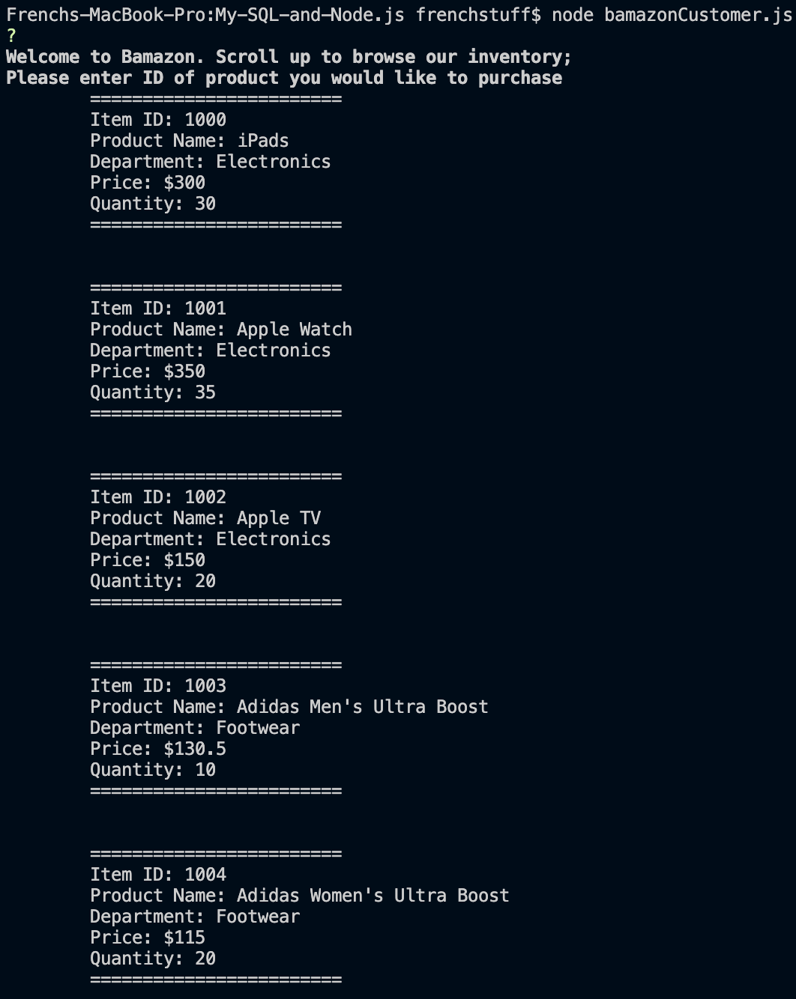
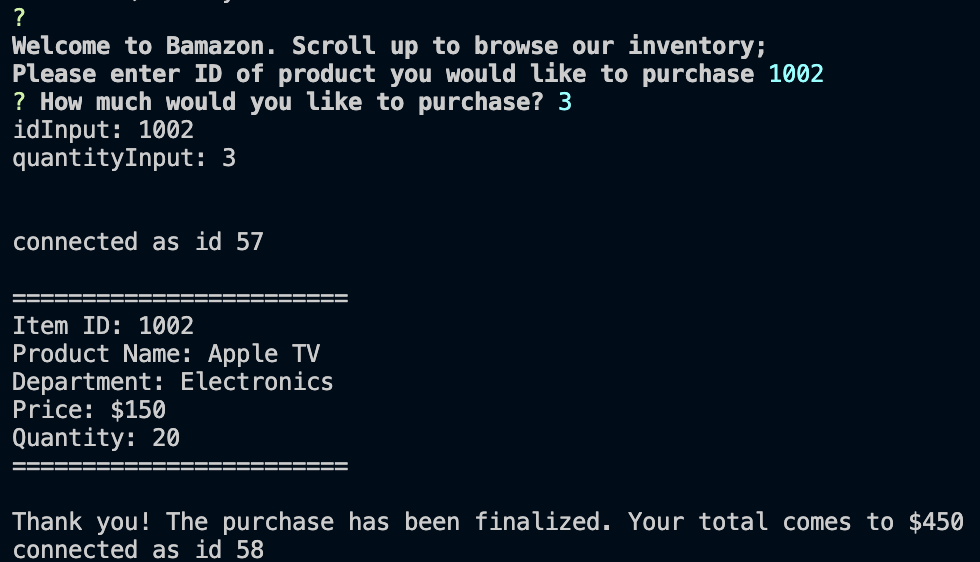
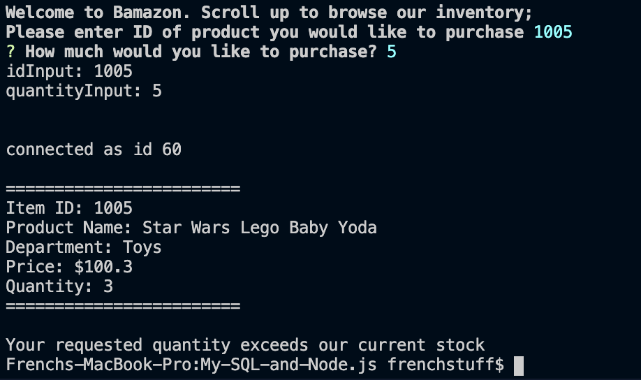

# My-SQL-and-Node.js
###Overview

This is a simple node.js application that demonstrates embedded SQL for a mock store inventory

###Application structure The app is dependent on the following packages: mysql and inquirer. The user is shown the current inventory of the store and then, after a key is pressed, will be prompted to select an item by its ID number and quantity they would like to purchase If the order inputed exceeds the item's stock, the user ill be denied. Otherwise the terminal will log the total cost of the purchase and update the SQL database with the appropriate stock number.

###Images of application in use

EXISTING TABLE OF ITMES

MESSAGE AFTER SELECTING ITEM ID AND STOCK AMOUNT TO BUY

MESSAGE IF CUSTOMER EXCEEDS STOCK QUANTITY

